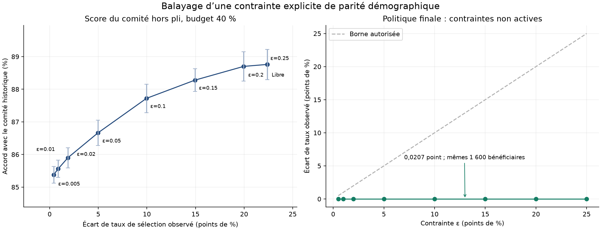

## Front de Pareto observable : contrainte de parité explicite

Le cahier exige plusieurs réglages d’une contrainte d’équité. Nous fixons **ε = 0 ; 0,005 ; 0,01 ; 0,02 ; 0,05 ; 0,10 ; 0,15 ; 0,20 ; 0,25 ; sans contrainte**, avant le calcul. ε borne la différence absolue entre les taux de sélection des centres et des régions éloignées. Budget fixé à 40 % pour chaque cohorte. ε = 0,005 correspond à **0,5 point de pourcentage**, pas 0,005 point.

Dans chaque pli externe de 2 000 observations, on utilise les probabilités déjà produites hors pli par le modèle du comité. On énumère chaque nombre entier admissible de bourses régionales et on sélectionne les meilleurs scores de chaque groupe. L’allocation retenue maximise la somme des probabilités prédites, sous quota total et contrainte de parité. Les étiquettes du pli servent seulement à mesurer les résultats ; aucun seuil n’est ajusté pour optimiser ses étiquettes. Il s’agit d’une politique de sélection par cohorte utilisant ses groupes et scores, pas d’un seuil individuel estimé sur ces étiquettes.

**Les résultats sont des diagnostics contre les décisions biaisées du comité, pas contre le mérite.** L’accuracy mesure ici un accord historique ; le TPR signifie « proportion des anciens bénéficiaires sélectionnés ». Ni ce TPR ni sa différence régionale ne mesurent l’égalité des chances officielle. Aucun point de ce balayage n’est utilisé pour modifier la recommandation.

À ε = 0.005, l’écart moyen est **0.417 points**, l’accord historique **85.380 %** et le F1 macro **84.767 %**. Sans contrainte, l’écart est **22.375 points**, l’accord **88.760 %** et le F1 macro **88.289 %**. Les moyennes utilisent les cinq plis externes, avec exactement 800 bourses par pli. La parité exacte (ε = 0) est faisable dans trois plis seulement ; aucune moyenne sur ce sous-ensemble n’est présentée comme comparable aux cinq plis. Les barres représentent une erreur standard descriptive entre cinq plis dépendants ; elles n’estiment pas l’incertitude du mérite caché.

Le fichier `front_pareto_moyennes.csv` identifie séparément les points non dominés pour écart/accuracy, écart/F1 et écart/somme des scores. « Non dominé » est limité à cette grille et à ces métriques auxiliaires. Les seuils de contrainte et le modèle de score sont fixés ; cette analyse ne constitue pas une nouvelle sélection indépendante de modèle. Les métriques TPR/FPR par groupe et les comptes TP/FN/FP/TN figurent dans `contraintes_hors_pli.csv`.

La **politique finale neutralisée** est analysée séparément sur les 4 000 demandes sans étiquette. Sa parité démographique est presque spontanée : **0,0207 point**. Toutes les contraintes ε ≥ 0,005 sont non actives et redonnent exactement les mêmes 1 600 bénéficiaires. La parité exacte est infaisable pour ces effectifs entiers et ce budget. Il serait trompeur de dessiner plusieurs allocations distinctes pour ce modèle : son front observé se réduit à un point. Les points distincts de la figure de gauche proviennent donc explicitement du modèle reproduisant le comité, à des fins de diagnostic. Cette expérience démontre un compromis observable, pas le front officiel caché. La parité démographique est un indicateur accessible, alors que l’égalité des chances contre mérite est le critère du jury que nous ne pouvons mesurer.

**Limites et décision.** La contrainte utilise directement le groupe régional ; c’est un mécanisme de post-traitement étudié et non appliqué à `predictions.csv`. Aucun label de mérite n’est inventé. Une meilleure concordance avec le comité ne prouve pas une meilleure utilité réelle. Pour déployer une contrainte d’égalité des chances, il faudrait un échantillon de mérite indépendant et une politique approuvée, puis une nouvelle validation. Notre allocation neutralisée et son CSV restent inchangés.

Reproduction depuis la racine : `.\.venv\Scripts\python.exe artifacts/equialgo/complements_20261003/pareto/balayage.py`. Le protocole, les décisions de diagnostic et la vérification numérique sont archivés dans le même dossier.
